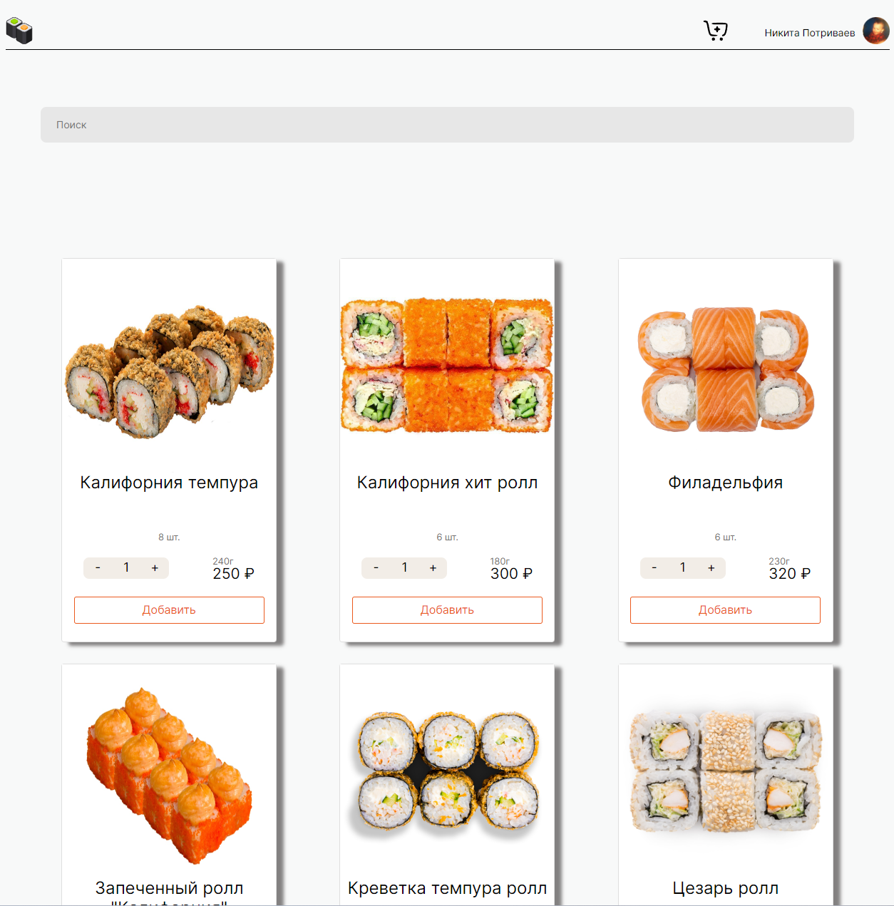

# Проект: Food-shop



---
### Обзор
Пет-проект представляет из себя онлайн магазин по оформлению заказов еды.

### Технологии
- JS;
- CSS;
- React;
- Api;
- Express;

### Дальнейшее улучшение
Согласовать изменённые данные из объекта карточек и объекта корзины.

## Инструкция
Чтобы запустить проект, нужно сделать несколько простых шагов.

- Создайте папку и перейдите в неё:

```
cd <Имя-папки>
```

- Склонируйте этот репозиторий:

```
git clone https://github.com/NikitaPotrivaev/food-shop-react.git
```

- Установите все зависимости:

```
npm install
```

- Создать два терминала, на одном терминале перейдите в папку shop-backend

```
cd shop-backend
```

- На другом перейдите в папку frontend

```
cd frontend
```

- В обеих папках пропишите

```
npm run dev
```

## Системные требования

Для запуска потребуется Node.js версии 20.9.0